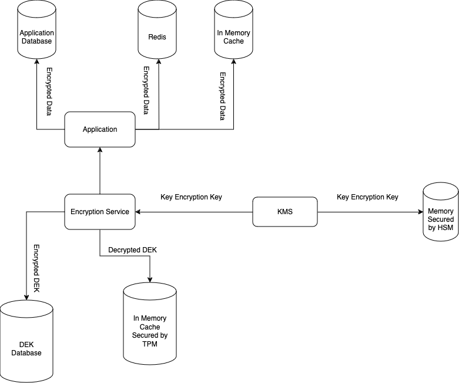

# Cripta

## Overview

A lightweight performant service to Encrypt and Decrypt your data and manage your Encryption Keys in a secure Storage.

The encryption service mainly has following functionalities:-
- **Encryption and Decryption**: Encrypt and decrypt data using secure algorithms and the managed DEKs.
- **Key Management**: Generate and Store Keys per entity which will be encrypted by a master key and stored in a secured manner.
- **Key Rotation**: Rotate DEKs on-demand to enhance security and comply with organizational policies.

## How does it work

- Application communicates with the service to create a key for the specific entity.
- Next time application has to encrypt/decrypt the data related to the entity, it has to send the entity identifier and the base64-encoded data, the Key Manager will encrypt/decrypt it for the application.
- All the communication between application and the encryption service are authorised by Mutual TLS
- All the Data Encryption Keys are Encrypted by either by securely generated AES-256 Key or a hosted Key Management Service (AWS KMS, Hashicorp Vault etc.)



## KMS Key Migration

Migrate your Data Encryption Keys (DEKs) from one KMS key to another without re-encrypting application data or changing DEK versions.

### Configuration

Enable `skip_key_id_on_decrypt` in your KMS config to allow AWS KMS to determine the decryption key from ciphertext metadata:

```toml
[secrets.kms_config]
key_id = "arn:aws:kms:region:account:key/new-key-id"
region = "us-east-1"
skip_key_id_on_decrypt = true  # Required for migration
```

### Migration Steps

1. **Enable the flag**: Set `skip_key_id_on_decrypt = true` in config
2. **Update KMS key**: Change `key_id` to your new KMS key ARN
3. **Restart service**: Deploy with the new configuration
4. **List Keys**: List the `key_ids` with filter `"key_source": "KMS"`

```bash
# List KMS encrypted Key IDs
curl -X POST http://localhost:6128/key/list \
  -H "Content-Type: application/json" \
  -H "X-Tenant-ID: public" \
  -d '{"key_source": "KMS"}'

# Get batched response
curl -X POST http://localhost:6128/key/list \
  -H "Content-Type: application/json" \
  -H "X-Tenant-ID: public" \
  -d '{"batch_size": 10}'
```
5. **Re-encrypt DEKs**: Call the re-encryption API

```bash
# Re-encrypt specific identifier
curl -X POST http://localhost:6128/key/reencrypt \
  -H "Content-Type: application/json" \
  -H "X-Tenant-ID: public" \
  -d '{"key_ids": []}'

# Re-encrypt ALL DEKs
curl -X POST http://localhost:6128/key/reencrypt \
  -H "Content-Type: application/json" \
  -H "X-Tenant-ID: public" \
  -d '{}'
```
**Note:** Use full Key ARN in config file during reencryption process.

