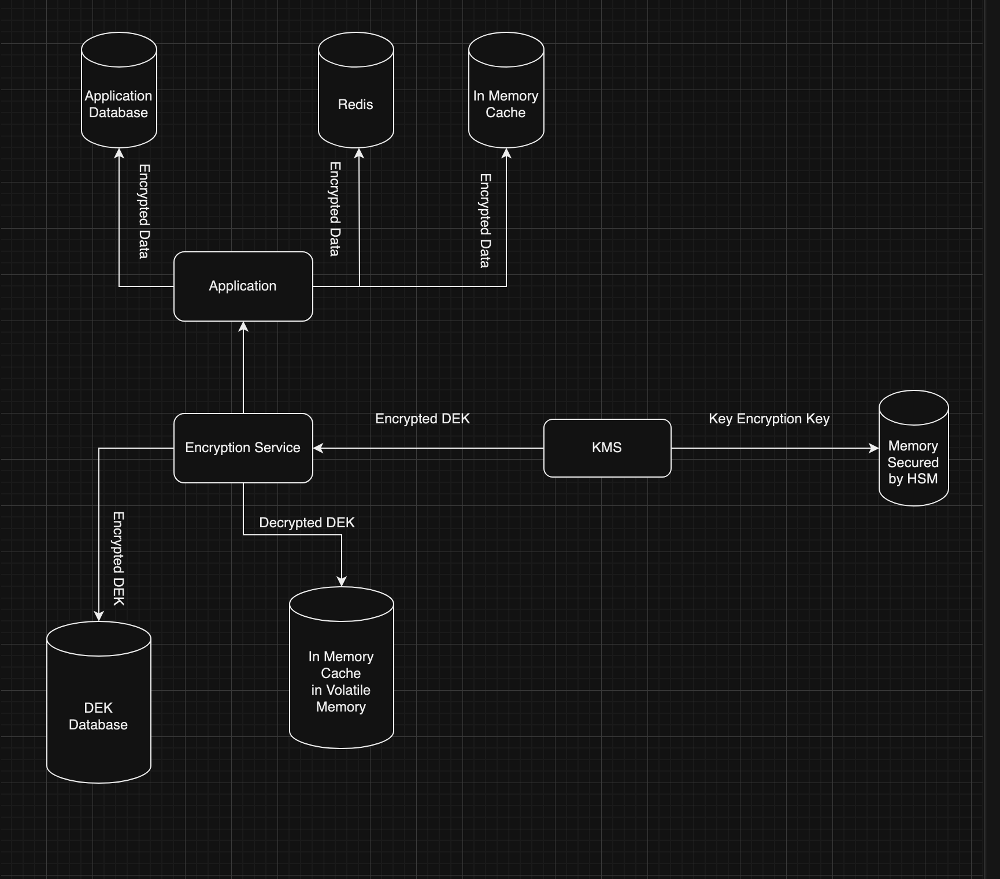

# Cripta

## Overview

A lightweight performant service to Encrypt and Decrypt your data and manage your Encryption Keys in a secure Storage.

The encryption service mainly has following functionalities:-
- **Encryption and Decryption**: Encrypt and decrypt data using secure algorithms and the managed DEKs.
- **Key Management**: Generate and Store Keys per entity which will be encrypted by a master key and stored in a secured manner.
- **Key Rotation**: Rotate DEKs on-demand to enhance security and comply with organizational policies.

## How does it work

- Application communicates with the service to create a key for the specific entity.
- Next time application has to encrypt/decrypt the data related to the entity, it has to send the entity identifier and the base64-encoded data, the Key Manager will encrypt/decrypt it for the application.
- All the communication between application and the encryption service are authorised by Mutual TLS
- All the Data Encryption Keys are Encrypted by either by securely generated AES-256 Key or a hosted Key Management Service (AWS KMS, Hashicorp Vault etc.)

## Development
- Cripta supports AES, AWS KMS, Hashicorp Vault as backends. Run cripta service with either of the backend by mentioning in feature flag. Ex: `cargo run --features=aes` for running with AES as backend.
- Run `docker compose --file docker-compose.yml up -d` to run required services (postgres, Hashicorp vault) for development.

### Hashicorp Vault Setup (Will be Automated in Future)
- Get into docker container: `docker exec -it hyperswitch-encryption-service-vault-1 /bin/sh`
- Enable transit secrets engine by running `vault secrets enable transit`
- Create encryption namespace with the name `orders` by running `vault write -f transit/keys/orders`
- Create environment variable in the host for authenticating with Vault (running in docker) `export CRIPTA__secrets__vault_token=vault_token`
 Run the cripta server `cargo run --features=vault` in host system
